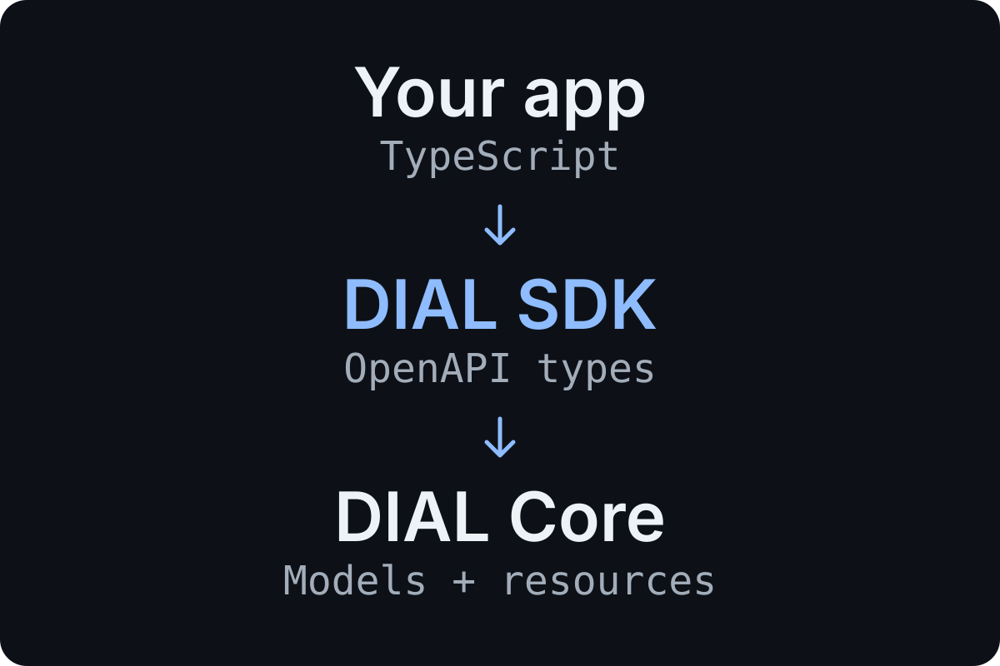

#  DIAL TypeScript SDK

Typed access to [DIAL Core](https://dialx.ai/): connect to models and manage files,
conversations, prompts and application resources from one TypeScript client.

**[Home page](https://epam.github.io/ai-dial-typescript-sdk/)** ·
**[Get started](https://epam.github.io/ai-dial-typescript-sdk/getting-started/)** ·
**[API reference](https://epam.github.io/ai-dial-typescript-sdk/api/)** ·
**[npm](https://www.npmjs.com/package/@epam/ai-dial-typescript-sdk)**

[](https://www.npmjs.com/package/@epam/ai-dial-typescript-sdk)
[](LICENSE)
[](https://github.com/epam/ai-dial-typescript-sdk/actions/workflows/pr.yml)

<picture>
  <source media="(min-width: 600px)" srcset="assets/readme/overview.svg">
  
</picture>

- **Types from the API contract.** Discover method arguments, request bodies and responses in your editor.
- **One connection.** Configure a base URL and authentication once; reuse them across model and resource calls.
- **Your transport.** Supply a custom `fetch` for your application's networking policies. The SDK is built on [openapi-fetch](https://openapi-ts.dev/openapi-fetch/).

## Install

```sh
npm install @epam/ai-dial-typescript-sdk
```

## Make your first request

Set `DIAL_URL` to your DIAL Core address and `DIAL_API_KEY` to a valid key, then
run this in a server-side TypeScript application with native `fetch`:

```typescript
import { createSDK } from '@epam/ai-dial-typescript-sdk';

const sdk = createSDK({
  baseUrl: process.env.DIAL_URL!,
  apiKey: process.env.DIAL_API_KEY!,
});

const { data, error, response } = await sdk.getDeployments();

if (!response.ok) {
  throw new Error(`DIAL request failed: ${response.status}`, { cause: error });
}

console.info(data);
```

This lists the deployments available to your credentials. Keep API keys on your
server. For configuration and error handling, see the
[getting-started guide](https://epam.github.io/ai-dial-typescript-sdk/getting-started/).

## Work with models

Use the `sdk` instance above and deployment names available on your DIAL instance.
Set `DIAL_API_VERSION` to a version supported by the target deployment.

### Create embeddings

```typescript
const embeddings = await sdk.createEmbedding('your-embedding-deployment', {
  params: { query: { 'api-version': process.env.DIAL_API_VERSION! } },
  body: {
    input: ['TypeScript SDK', 'DIAL Core'],
    encoding_format: 'float',
  },
});

if (!embeddings.response.ok) {
  throw new Error(`Embedding request failed: ${embeddings.response.status}`);
}

console.info(embeddings.data?.data[0]?.embedding);
```

<details>
<summary><strong>Chat completion example</strong></summary>

The current generated TypeScript contract requires the fields shown below,
including several that have defaults in OpenAPI.

```typescript
const completion = await sdk.sendChatCompletionRequest('your-chat-deployment', {
  params: { query: { 'api-version': process.env.DIAL_API_VERSION! } },
  body: {
    messages: [{ role: 'user', content: 'Hello, DIAL.' }],
    stream: false,
    temperature: 0.7,
    top_p: 1,
    n: 1,
    max_tokens: 256,
    max_prompt_tokens: 4096,
    presence_penalty: 0,
    frequency_penalty: 0,
    logit_bias: null,
  },
});

if (!completion.response.ok) {
  throw new Error(`Chat request failed: ${completion.response.status}`);
}

console.info(completion.data?.choices?.[0]?.message.content);
```

</details>

## Explore the API

The [generated reference](https://epam.github.io/ai-dial-typescript-sdk/api/)
covers every public SDK method, with search, exact signatures, parameters and
request/response schemas.

| Work with              | Start here                                                                                                                                                                                                                                               |
| ---------------------- | -------------------------------------------------------------------------------------------------------------------------------------------------------------------------------------------------------------------------------------------------------- |
| Models and inference   | [Deployments](https://epam.github.io/ai-dial-typescript-sdk/api/getDeployments/), [chat](https://epam.github.io/ai-dial-typescript-sdk/api/sendChatCompletionRequest/), [embeddings](https://epam.github.io/ai-dial-typescript-sdk/api/createEmbedding/) |
| Stored resources       | [Files](https://epam.github.io/ai-dial-typescript-sdk/api/?category=Files), [conversations](https://epam.github.io/ai-dial-typescript-sdk/api/?category=Conversations), [prompts](https://epam.github.io/ai-dial-typescript-sdk/api/?category=Prompts)   |
| Applications and tools | [Applications](https://epam.github.io/ai-dial-typescript-sdk/api/?category=Applications), [toolsets](https://epam.github.io/ai-dial-typescript-sdk/api/?category=Toolsets)                                                                               |
| Collaboration          | [Sharing](https://epam.github.io/ai-dial-typescript-sdk/api/?category=Sharing), [publications](https://epam.github.io/ai-dial-typescript-sdk/api/?category=Publications)                                                                                 |

Available operations depend on your DIAL instance and permissions. Type checking
helps while writing code; it does not validate responses at runtime. Streaming,
retries and token refresh need application-side handling.

## Configure the client

`createSDK(options)` accepts:

| Option    | Type                     | Purpose                                                   |
| --------- | ------------------------ | --------------------------------------------------------- |
| `baseUrl` | `string`                 | Required DIAL Core address.                               |
| `apiKey`  | `string`                 | Sent as the `Api-Key` header.                             |
| `token`   | `string`                 | Sent as `Authorization: Bearer <token>`.                  |
| `headers` | `Record<string, string>` | Additional headers for requests.                          |
| `fetch`   | `typeof fetch`           | Custom transport, instrumentation or test implementation. |

Use an API key or bearer token according to your DIAL setup. HTTP results contain
`data` or `error` and the original `Response`; transport and parsing failures can
throw. Path values are positional arguments, query/header values belong in
`init.params`, and request payloads belong in `init.body`.

## Develop and contribute

Use Node.js 24, as in CI, and install dependencies with `npm ci`.

| Command                 | Purpose                                                     |
| ----------------------- | ----------------------------------------------------------- |
| `npm run build`         | Build the SDK's ESM, CJS and TypeScript declarations.       |
| `npm run dev`           | Rebuild the SDK as sources change.                          |
| `npm run gen`           | Regenerate the SDK and reference from `open_api_core.yaml`. |
| `npm run docs:generate` | Refresh the website's API reference.                        |
| `npm run docs:check`    | Detect stale generated documentation.                       |
| `npm run docs:test`     | Check documentation generation, examples and static routes. |
| `npm run lint`          | Run ESLint.                                                 |
| `npm run format`        | Format the repository with Prettier.                        |

After editing `open_api_core.yaml`, run `npm run gen`. It bundles the contract,
regenerates `src/schema.ts`, `src/client.ts` and `src/api-paths.ts`, then updates
the website reference. Prefer editing the contract and generator over generated files.

### Run the website

```sh
npm ci --prefix website
npm run website:dev
```

The React site is an independent private package. Its dependencies and build
output are excluded from the published SDK. `npm run website:build` writes to
`website/dist/`; the [Pages workflow](.github/workflows/website.yml) publishes
that directory from `development`. See [website/README.md](website/README.md)
for hosting and deployment setup.

See [CONTRIBUTING.md](CONTRIBUTING.md) for contribution guidelines. PR titles
follow [Conventional Commits](https://www.conventionalcommits.org/).

## License

[Apache-2.0](LICENSE).
